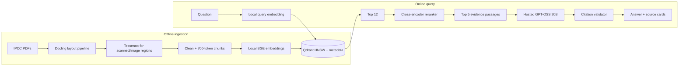

# Approach and Technique Decisions

## 1. Problem framing

The requirement is not merely “chat with a PDF.” It combines four independently testable systems:

1. Recover trustworthy content from a heterogeneous PDF corpus.
2. Retrieve the correct evidence quickly.
3. Generate an answer that stays inside that evidence.
4. Preserve enough provenance to let a reviewer verify the answer.

The implementation therefore treats ingestion and answering as separate paths. Expensive parsing,
OCR and embedding happen offline once. The online path contains only one query embedding, HNSW
search, reranking and one bounded generation request.

## 2. Why Challenge 1

Challenge 1 has one measurable critical path and allows ingestion to be precomputed. Challenge 2
would require browser screen capture, OCR, speech-to-text, local LLM inference, adaptive dialogue
and scoring to all work simultaneously. In six hours, integration and browser-permission risk would
dominate the actual AI work. The RAG project still demonstrates document AI, embeddings, ANN
search, reranking, prompt design, evaluation and product presentation.

## 3. Decision matrix

| Decision | Selected | Alternatives | Why selected | Cost / mitigation |
|---|---|---|---|---|
| Parser | Docling standard pipeline | PyMuPDF only, pdfminer, VLM parsing | Reading order, tables, OCR routing and provenance share one document model | Heavier and slower; cache by SHA-256 and keep it off the query path |
| OCR | Tesseract through Docling | EasyOCR, RapidOCR, hosted OCR | Open-source, mature and easy to package consistently in Debian | Language packs are explicit; English is pinned for the IPCC corpus |
| Pipeline mode | Standard, PDF-aware OCR | Full-page OCR, VLM pipeline | Reuses good native text and OCRs relevant image regions | A truly damaged PDF may need a full-page retry in a future version |
| Chunking | Structure-aware, 700 max tokens, 105 overlap | Fixed characters, sentences only, 1,000+ tokens | Headings keep semantic context; 15% overlap protects boundary facts | Overlap increases storage slightly; deterministic IDs prevent duplicates |
| Embeddings | BGE small English v1.5 | MiniLM, MPNet, hosted embeddings | 384 dimensions, good retrieval quality, fast CPU inference and permissive license | English-specific; switch model and rebuild collection for multilingual data |
| Vector DB | Qdrant | FAISS + SQLite, Chroma, PostgreSQL/pgvector | Real OSS vector DB, HNSW, payload metadata, filters and snapshots | One more service; Docker Compose and health checks make it reproducible |
| Candidate count | Dense top 12, final top 5 | Direct top 5, very large K | Enough recall for reranking without bloating the prompt | Tune from labeled evaluation instead of guessing |
| Reranker | MS MARCO MiniLM cross-encoder | No reranker, hosted reranker | Jointly reads query and passage and improves ordering on CPU | Adds latency; timed separately and can be disabled if it is the bottleneck |
| Generator | Groq-hosted GPT-OSS 20B | Local llama.cpp, Gemini, paid APIs | Open-weight model, free-plan access and low latency suitable for the 2–5s target | Requires internet and shares retrieved excerpts; use local/private LLM for confidential production data |
| Citations | Application labels `[S1]`–`[S5]` | Ask model to print filename/page | The application owns page metadata, so the model cannot invent coordinates | Semantic support still needs evaluation; syntax validation alone is insufficient |
| UI | Streamlit | React + FastAPI, Gradio | Chat, charts, tables and status views in one Python codebase | Less UI flexibility; appropriate for a six-hour demonstrator |
| Portability | Source-built Docker Compose + Qdrant snapshot | Native Windows install, raw DB directory, prebuilt opaque image | Keeps code visible and makes Linux dependencies identical on Windows | Docker image is large; transfer caches and verify 30 GB free space |

## 4. Document extraction and OCR

### Why Docling and Tesseract are both present

Docling is the document-understanding pipeline. It decides reading order, identifies headings,
tables, pictures, headers and footers, and attaches provenance. Tesseract is one OCR engine inside
that pipeline; it turns pixels into characters. Tesseract alone would not reconstruct the document
hierarchy or connect a paragraph to a bounding box.

The standard pipeline is intentionally used instead of a vision-language-model pipeline. The IPCC
reports are mostly born-digital. A VLM would increase downloads, CPU time and nondeterminism for a
problem already handled by native text plus selective OCR. Docling's PDF-aware OCR mode prefers the
PDF text layer and OCRs layout regions where bitmap/vector content requires it.

Every PDF is checked before conversion:

- `%PDF-` signature and successful parser open.
- At least 200 pages.
- SHA-256 checksum.
- A sample-based estimate of native versus likely OCR pages.

The SHA-256 is also the cache key. If a file changes, its document ID and every stable chunk ID
change, which prevents stale chunks from silently surviving.

### Cleaning

Unicode is normalized to NFKC, line-break hyphenation is repaired, and whitespace is collapsed.
Docling's structural labels prevent most page headers and footers from entering body chunks. A
repeated-margin utility is separately tested for formats where recurring edge text survives.

Language detection is deterministic (`langdetect` seed zero) and stored as metadata. English is
the OCR language because the selected corpus is English; detecting a different language is a
signal to re-ingest with the corresponding Tesseract language pack, not permission to silently OCR
with the wrong model.

## 5. Chunking

Embedding a whole report would hide local facts inside one vector and exceed model token limits.
Very small chunks lose context. The prototype notebook compares approximately 400, 700 and 1,000
token settings; 700 is the starting compromise, not a universal constant.

Docling's hybrid chunker starts from document structure and only splits sections that exceed the
token budget. The production layer adds a 105-token tail from the previous chunk. This 15% overlap
preserves facts spanning a boundary. Each chunk stores all contributing page numbers and bounding
boxes, not just a guessed starting page.

Stable chunk IDs are hashes of document SHA-256, position and normalized text. Re-ingesting the
same bytes produces the same identifiers.

## 6. Embedding, ANN search and reranking

The bi-encoder embeds documents during ingestion and embeds each question once at query time.
Normalized vectors make cosine similarity stable and efficient. BGE-small produces 384-dimensional
vectors, keeping the index compact enough for CPU demonstration hardware.

Qdrant uses HNSW, an approximate graph index. Approximation trades a small amount of recall for
much faster nearest-neighbor search. Payloads keep the vector and its filename, pages, headings and
geometry together. Keyword payload indexes are created before ingestion so later document or
language filtering does not require scanning all payloads.

Dense retrieval is fast but scores a query and passage independently. The cross-encoder reads the
pair together, so it is more accurate but too expensive for the entire corpus. Applying it only to
the top 12 provides a conventional retrieve-then-rerank compromise. Overlapping results from the
same page are deduplicated before selecting the final five.

## 7. Grounded generation and citations

The prompt contains only five labeled passages and four rules: stay within evidence, cite factual
paragraphs, use only supplied labels, and refuse when evidence is insufficient. Temperature is
zero and the answer is capped to keep latency and free-tier token usage predictable.

The important design choice is that the LLM never supplies authoritative filename or page data.
It returns `[S2]`; application code resolves `S2` to the retrieved chunk. Invalid labels are removed
and reported. Uncited factual-looking paragraphs generate a warning.

This prevents fabricated page numbers, but it does not prove that a cited passage supports a
claim. Citation support and hallucination rate therefore require labeled or manual claim-level
review. The evaluation code deliberately reports hallucination rate as unset until that review is
performed rather than presenting a misleading automated number.

## 8. Latency strategy

The 2–5 second objective applies to warm query-to-complete-answer time, not one-time ingestion.
Every stage uses `perf_counter` and is logged independently:

- Query embedding.
- Qdrant retrieval.
- Cross-encoder reranking.
- Hosted generation.
- Total time.

Before changing quality settings, optimize the measured bottleneck. If generation dominates,
reduce answer length or context. If reranking dominates, reduce candidates or disable it after
checking R@5/MRR. Hiding a stage from the metric is not an acceptable optimization.

Actual p50/p95 values belong in `artifacts/evaluation-report.json` after running on the demo laptop.
They are not claimed in advance because network and hardware determine the result.

## 9. Evaluation

The included set has ten answerable questions associated with expected reports and five deliberate
out-of-corpus questions.

- **R@5:** fraction of answerable questions whose expected report appears in the top five.
- **MRR:** mean reciprocal rank of the first expected report.
- **Citation-label validity:** whether every `[S#]` resolves to supplied evidence.
- **Citation support:** manual judgment that the evidence actually supports the claim.
- **Refusal accuracy:** fraction of unanswerable questions refused.
- **Hallucination rate:** unsupported factual claims divided by reviewed factual claims.
- **p95 latency:** 95th percentile of complete warm queries.

Target values are R@5 ≥ 0.80, MRR ≥ 0.70, citation support ≥ 90%, refusal accuracy ≥ 80%,
hallucination rate ≤ 10%, and end-to-end p95 ≤ 5 seconds. These are acceptance targets, not
hard-coded results.

## 10. Privacy, security and failure behavior

The PDFs, OCR output, embeddings and vector database remain local. The five retrieved passages are
sent to Groq. That is acceptable for this public IPCC demonstration, but it is a material limitation
for the assignment's “private corpus” wording. A real confidential deployment would use a local
quantized model, a private VPC endpoint, contractual no-retention controls, or an approved inference
gateway.

Secrets come only from `.env`, which is excluded from Git and the transfer ZIP. User questions are
not interpolated into shell or database commands. The UI displays errors rather than converting a
generation failure into an uncited answer.

## 11. Reproducibility and Windows portability

The Windows laptop receives source, documents, model caches, Docling chunk caches, evaluation
artifacts and an official Qdrant snapshot. It does not receive Linux Qdrant storage files. Docker
Desktop runs Linux containers, so the cached model files remain usable across hosts.

The PowerShell preflight checks Docker, memory and free disk. The application image is built from
the local copied source. Snapshot metadata records the collection and embedding model; vector
dimension is also checked when opening an existing collection. `SHA256SUMS` detects incomplete or
corrupted transfers.

## 12. Known limitations and production improvements

- Corpus language is English; multilingual OCR and embeddings require explicit model changes.
- A single local Qdrant instance has no replication, authentication or backup policy beyond the
  snapshot.
- Streamlit sessions are not a multi-user security boundary.
- Header/footer removal can require document-specific rules.
- Figures are OCRed when they contain text, but chart semantics are not interpreted by a VLM.
- A hosted generator means the online path is not fully offline.
- Thresholds must be tuned against real labeled questions after ingestion.

Production evolution would add authenticated APIs, tenant isolation, encrypted object storage,
background ingestion jobs, observability, automated claim-level groundedness evaluation, hybrid
dense/sparse retrieval, and a private inference endpoint.

## 13. Interview questions and short answers

**Why RAG instead of fine-tuning?**  The knowledge changes with documents, citations must point to
specific pages, and indexing is cheaper and more reproducible than retraining.

**Why precompute embeddings?**  A report chunk is stable across questions. Re-embedding it on every
query would dominate latency and cost.

**Why not send whole PDFs to the LLM?**  It increases latency, cost and distraction, and weakens
traceability. Retrieval selects a small auditable evidence set.

**Why Docling instead of only PyMuPDF?**  PyMuPDF is excellent for fast native extraction, but
Docling provides one structured representation for layout, OCR regions, tables and provenance.

**Why not OCR every page?**  OCR is slower and can corrupt high-quality native text. PDF-aware OCR
keeps native text and targets image regions.

**Why overlap chunks?**  Facts and sentences can cross an arbitrary split. A small overlap protects
boundary context without duplicating most of the corpus.

**Why Qdrant rather than FAISS?**  FAISS is an ANN library. Qdrant adds persistence, payloads,
filtering, collection management and portable snapshots while still using HNSW.

**Why rerank?**  Dense similarity gives high recall cheaply; the cross-encoder improves precision
only on the small candidate set.

**How are citations made safe?**  The model chooses an opaque source label. Application code owns
and renders the filename, page and bounding box, and rejects labels it did not provide.

**Does a citation guarantee truth?**  No. It guarantees traceability. Semantic support is separately
evaluated with labeled/manual review.

**What happens if Groq fails?**  The app exposes the retrieved evidence and the provider error; it
does not synthesize an uncited fallback answer.

**Is this suitable for private documents?**  Local ingestion and retrieval are, but the hosted
generation step sends selected excerpts externally. Production must use an approved private or
local generator.

**How is the 2–5 second target verified?**  Complete warm queries are timed stage by stage and p95 is
computed from recorded runs on the actual demo hardware.

